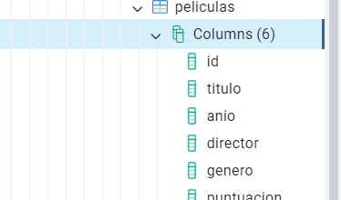
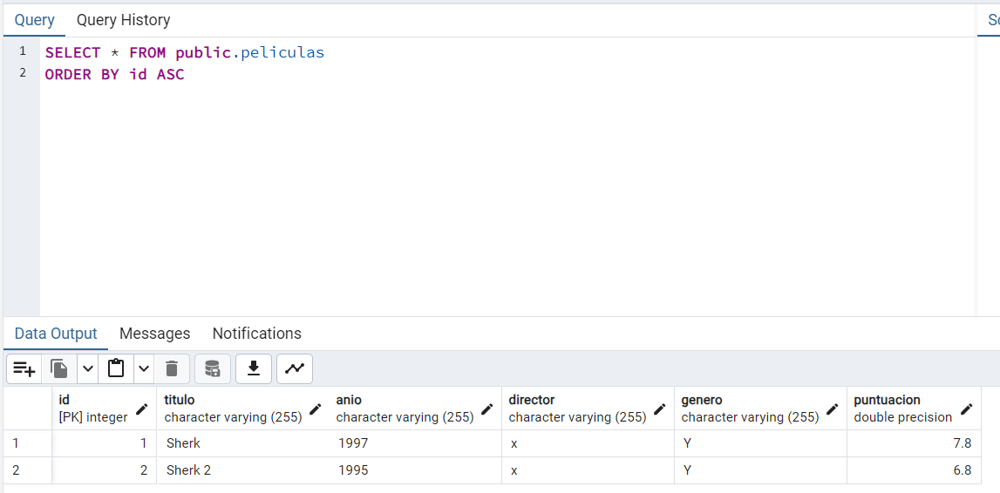

# M10_UF2

# Comprobación CRUD
 

## Crear tabla y su comprobación   
   

  

## Insertar valores y su comprobación

  

## Eliminar pelicula y su comprobación

  

## Actualizar pelicula y su comprobación

  

## Leer pelicula y su comprobación

